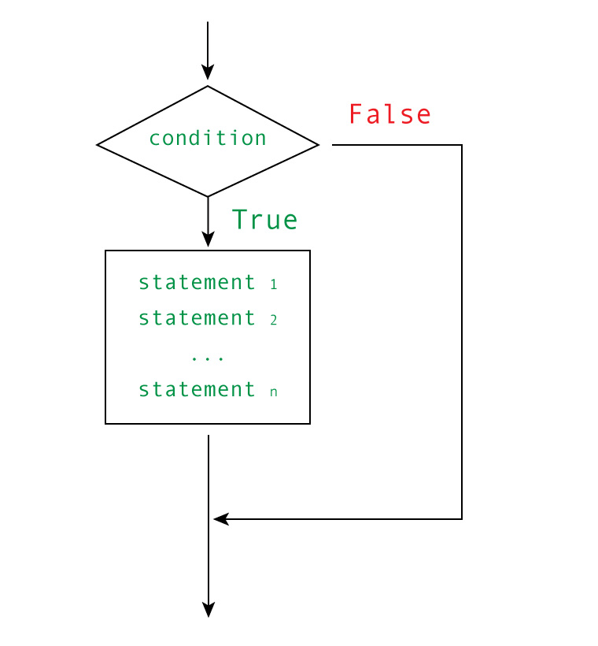

if 语句
####################################

Python 条件语句是通过一条或多条语句的执行结果（True 或 False）来决定执行的代码块。

可以通过下图来简单了解条件语句的执行过程:

if 语句能够有条件地执行代码。这意味着如果条件（if 和冒号之间的表达式）为真，就执行缩进代码块中的代码；如果条件为假，则不执行。

.. highlight:: none

::

    >>> if 'a' == 'a':
    ...     print('aaaaa')
    ... 
    aaaaa

else 子句
************************************

如果条件语句为 False，可使用 else 子句增加一种选择（之所以叫子句是因为 else 不是独立的语句，而是 if 语句的一部分）。

::

    >>> if 'a' == 'b':
    ...     print('aaaaa')
    ... else:
    ...     print('bbbbb')
    ... 
    bbbbb

在这里，如果没有执行 if 代码块（因为条件为假），将进入 else 代码块。当 if 和　else　联合使用时，必定会执行其中一个代码块。

还有一个与 if 语句很像的“亲戚”，它就是条件表达式，C 语言中三目运算符的 Python 版本。下面的表达式使用 if 和 else 确定其值：

::

    status = "friend" if name.endswith("Gumby") else "stranger"

如果条件为真，表达式的结果为第一个值（friend），否则为第二个值（stranger）。

elif 子句
************************************

要检查多个条件，可使用 elif（else if 的缩写）。

::

    num = int(input('Enter a number: '))
    if num > 0:
        print('The number is positive')
    elif num < 0:
        print('The number is negative')
    else:
        print('The number is zero')

代码块嵌套
************************************

在 if 语句代码块中可以加入其他 if 语句块中。

::

    name = input('What is your name? ')
    if name.endswith('Gumby'):
        if name.startswith('Mr.'):
            print('Hello, Mr. Gumby')
        elif name.startswith('Mrs.'):
            print('Hello, Mrs. Gumby')
        else:
            print('Hello, Gumby')
    else:
        print('Hello, stranger')

这里，如果名字以 Gumby 结尾，然后会检查名字开头。
