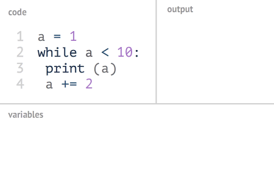

while 循环语句
####################################

while 语句会在条件表达式为真的前提下，循环执行代码块，直到条件表达式为假时结束循环。

.. highlight:: none

::

    >>> a = 1
    >>> while a < 10:
    ...     print(a)
    ...     a += 2
    ... 
    1
    3
    5
    7
    9

while 循环语句的控制结构图如下所示：

控制循环
************************************

在 while 循环中，可以在表达式为真时，提前结束循环或结束本次循环。

break 提前结束循环
====================================

break 语句用于提前结束（跳出）循环。

::

    >>> a = 1
    >>> while a < 10:
    ...     if a > 6:
    ...         break
    ...     print(a)
    ...     a += 2
    ... 
    1
    3
    5

continue 结束本次循环
====================================

continue 语句用于结束本次循环，并跳到循环开头继续执行（跳过循环体中余下的语句，但不结束循环）。

::

    >>> a = 0
    >>> while a < 10:
    ...     a += 1
    ...     if a % 2:
    ...         continue
    ...     print(a)
    ... 
    2
    4
    6
    8
    10

循环中的 else 子句
************************************

else 子句在循环正常结束时（没有执行 break 语句），才会执行代码块。

::

    >>> a = 0
    >>> while a < 10:
    ...     a += 1
    ...     if a % 2:
    ...         continue
    ...     print(a)
    ... else:
    ...     print('The END')
    ... 
    2
    4
    6
    8
    10
    The END

    # 执行 break 语句后，不会在执行 else 子句
    >>> a = 0
    >>> while a < 10:
    ...     a += 1
    ...     if a == 5:
    ...         break
    ...     print(a)
    ... else:
    ...     print('The END')
    ... 
    1
    2
    3
    4

.. note::

    无论是在 for 循环还是 while 循环中，都可使用 continue 语句和 break 语句及其 else 子句。
