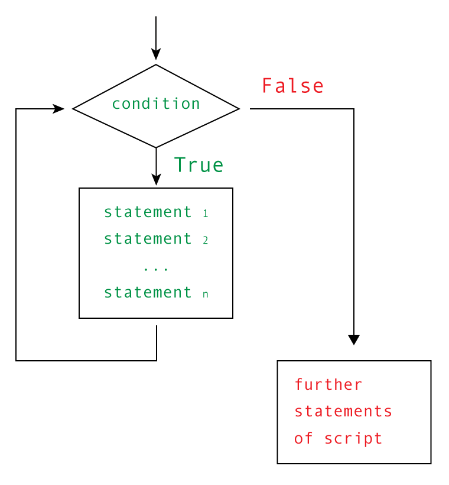

while 语句
########################

Python 中的循环语句有 for 和 while。循环语句的控制结构图如下所示：

.. highlight:: none

::

    name = ''
    while not name:
         name = input('Please enter your name: ')
    print('Hello, {}!'.format(name))

只要条件为真，while 语句就会无线循环的执行下去。

跳出循环
************************

通常，循环会不断地执行代码块，直到条件为假或使用完序列中的所有元素。但在有些情况下，你可能想中断循环、开始新迭代（进入“下一轮”代码块执行流程）或直接结束循环。

break
========================

要结束（跳出）循环，可使用 break。假设你要找出小于 100 的最大平方值（整数与自己相乘的结果），可从 100 开始向下迭代。找到一个平方值后，无需再迭代，因此直接跳出循环。

::

    from math import sqrt
    for n in range(99, 0, -1):
        root = sqrt(n)
        if root == int(root):
            print(n)
            break

这个程序将打印到 81 并结束。

continue
========================

语句 continue 没有 break 用得多。它结束当前迭代，并跳到下一次迭代开头。这基本上意味着跳过循环体中余下的语句，但不结束循环。这在循环体庞大而复杂，且存在多个要跳过它的原因时很有用。在这种情况下，可使用 continue ，如下所示：

::

    for x in seq:
        if condition1: continue
        if condition2: continue
        if condition3: continue

        do_something()
        do_something_else()
        do_another_thing()
        etc()

然而，在很多情况下，使用一条if 语句就足够了。

::

    for x in seq:
        if not (condition1 or condition2 or condition3):
            do_something()
            do_something_else()
            do_another_thing()
            etc()

continue 虽然是一个很有用的工具，但并非不可或缺的。然而，你必须熟悉 break 语句，因为在 while True 循环中经常用到它。

while True/break 成例
========================

在 Python 中，for 和 while 循环非常灵活，但偶尔遇到的一些问题可能让你禁不住想：如果这些循环的功能更强些就好了。例如，假设你要在用户根据提示输入单词时执行某种操作，并在用户没有提供单词时结束循环。为此，一种办法如下：

::

    word = 'dummy'
    while word:
        word = input('Please enter a word: ')
        # 使用这个单词做些事情：
        print('The word was', word)

这些代码的运行情况如下：

::

    Please enter a word: first
    The word was first
    Please enter a word: second
    The word was second
    Please enter a word:

这与你希望的一致，但你可能想使用单词做些比打印它更有用的事情。然而，如你所见，这些代码有点难看。为进入循环，你需要将一个哑值（未用的值）赋给 word。像这样的哑值通常昭示着你的做法不太对。下面来尝试消除这个哑值。

::

    word = input('Please enter a word: ')
    while word:
        # 使用这个单词做些事情：
        print('The word was ', word)
        word = input('Please enter a word: ')

哑值消除了，但包含重复的代码（这样也不好）：需要在两个地方使用相同的赋值语句并调用 input。如何避免这样的重复呢？可使用成例 while True/break 。

::

    while True:
        word = input('Please enter a word: ')
        if not word: break
        # 使用这个单词做些事情：
        print('The word was ', word)

while True 导致循环永不结束，但你将条件放在了循环体内的一条 if 语句中，而这条 if 语句将在条件满足时调用 break 。这说明并非只能像常规 while 循环那样在循环开头结束循环，而是可在循环体的任何地方结束循环。if/break 行将整个循环分成两部分：第一部分负责设置（如果使用常规 while 循环，将重复这部分），第二部分在循环条件为真时使用第一部分初始化的数据。

虽然应避免在代码中过多使用 break（因为这可能导致循环难以理解，在一个循环中包含多个 break 时尤其如此），但这里介绍的技巧很常见，因此大多数 Python 程序员都能够明白你的意图。

循环中的 else 子句
************************

通常，在循环中使用 break 是因为你“发现”了什么或“出现”了什么情况。要在循环提前结束时采取某种措施很容易，但有时候你可能想在循环正常结束时才采取某种措施。如何判断循环是提前结束还是正常结束的呢？可在循环开始前定义一个布尔变量并将其设置为 False ，再在跳出循环时将其设置为 True 。这样就可在循环后面使用一条 if 语句来判断循环是否是提前结束的。

::

    broke_out = False
    for x in seq:
        do_something(x)
        if condition(x):
            broke_out = True
            break
        do_something_else(x)
    if not broke_out:
        print("I didn't break out!")

一种更简单的办法是在循环中添加一条 else 子句，它仅在没有调用 break 时才执行。继续前面讨论 break 时的示例。

::

    from math import sqrt
    for n in range(99, 81, -1):
        root = sqrt(n)
        if root == int(root):
            print(n)
            break
    else:
        print("Didn't find it!")

请注意，无论是在 for 循环还是 while 循环中，都可使用 continue 、break 和 else 子句。
