guizero 文档
################################

guizero 是标准 Tkinter 库的包装器，目标是让初学者更快速、轻松地创建 GUI 界面。使用 guizero 基本不需要 Tkinter 的知识，只需要基本的 Python 知识结构。如何安装 guizero 请参见 `PYPI`_。

.. _PYPI: https://pypi.org/project/guizero/

.. warning ::

    guizero 只适用于 Python3 环境，不支持 Python2.7。在使用 guizero 之前必须安装 Tkinter。

快速开始
*******************************

入门
===============================

从 guizero 库中选择您需要的小部件并导入它们：

.. highlight:: none

::

    from guizero import App, PushButton, Slider

Hello World
-------------------------------

所有 guizero 程序都以一个 ``App()`` 的主窗口开始，以 ``app.display()`` 结尾。

创建一个标题为“Hello world”的应用程序窗口：

::

    from guizero import App
    app = App(title="Hello world")
    app.display()

保存并运行上边的代码 - 您已经创建了第一个guizero应用程序！如下所示：

.. image:: ../images/guizero.01.jpg

添加小部件
-------------------------------

窗口小部件是显示在 GUI 上的内容，例如文本框、按钮、滑块、图片等。

所有的小部件都在主窗口 ``App()`` 和 ``app.display()`` 之间创建。

::

    from guizero import App, Text
    app = App(title="Hello world")
    message = Text(app, text="Welcome to the Hello world app!")
    app.display()

.. image:: ../images/guizero.02.jpg

让我们详细地看一下 Text 小部件的代码：

* message = Text 对象有一个名称，就像任何变量一样
* Text() 在屏幕上创建一段文本的对象
* app 文本对象的主窗口，即它将存在的位置。
* text="" 要显示的文本内容

要了解更多详细信息请查看 小部件_

命令
===============================

guizero 中的小部件可以在创建时给出命令。通过使用命令，可以在用户操作时执行特定命令。

以下程序，在按下按钮并松开时显示 hello world 文本内容：

::

    from guizero import App, Text, PushButton

    def say_hello():
        text.value = "hello world"

    app = App()
    text = Text(app)
    button = PushButton(app, command=say_hello)
    app.display()

.. image:: ../images/guizero.03.gif

页面布局
===============================

GUI 的布局就是如何在窗口中安排小部件。

可以有两种布局方式将小部件安排到“容器”（例如 ``App`` 和 ``Box`` ）中：

* auto 自动布局（默认值）
* grid 网格布局

使用容器的布局参数设置布局，例如：

::

    app = App(layout="auto")
    app = App(layout="grid")

如果未指定布局参数，则使用默认值。

自动布局
-------------------------------

auto 是创建容器时使用的默认值。所有小部件将按创建顺序上下排列并以中心对齐，例如以下代码将创建两个 Text 小部件，一个在另一个之上。

::

    from guizero import App, Text
    app = App()
    text_1 = Text(app, text="on top")
    text_2 = Text(app, text="below")
    app.display()

.. image:: ../images/guizero.04.jpg

对齐布局
-------------------------------

窗口小部件可以在创建时使用 ``align`` 属性来修改默认的对齐方式。

定义对齐小部件的值包括 ``top`` ``bottom`` ``left``  ``right`` ：

::

    from guizero import App, Text
    app = App()
    top_text = Text(app, text="at the top", align="top")
    bottom_text = Text(app, text="at the bottom", align="bottom")
    left_text = Text(app, text="to the left", align="left")
    right_text = Text(app, text="to the right", align="right")
    app.display()

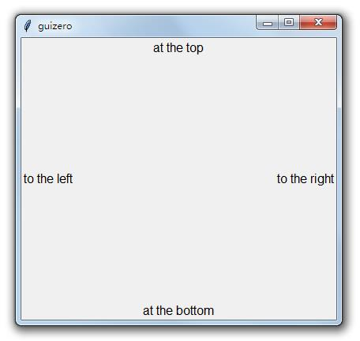

通过将多个小部件对齐到容器的同一侧，可以使小部件堆叠在一起，例如：

::

    from guizero import App, Text, TextBox, PushButton
    app = App()
    text = Text(app, text="label", align="left")
    text_box = TextBox(app, text="enter text", align="left")
    button = PushButton(app, text="submit", align="left")
    app.display()

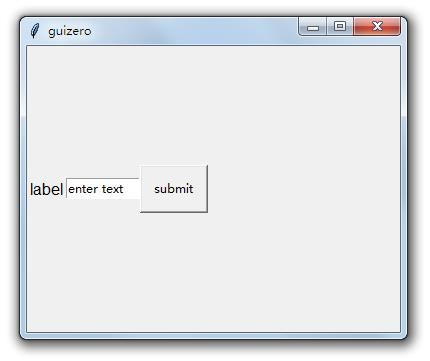

窗口小部件将按创建顺序堆叠，因此首先创建的窗口小部件将最接近指定方向的边缘。

填充
-------------------------------

通过设置要填充的宽度和高度参数，还可以使窗口小部件“填充”所有可用空间。

TextBox 可以跨越容器的整个宽度：

::

    from guizero import App, TextBox
    app = App()
    text_box = TextBox(app, text="enter text", width="fill")
    app.display()

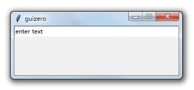

还可以将 ListBox 高度填充为 ``fill`` ，并且对齐方式为左对齐，例如：

::

    from guizero import App, ListBox
    app = App()
    list_box = ListBox(app, items=["a list"], height="fill", align="left")
    app.display()

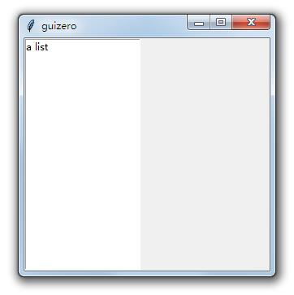

宽度和高度都设置成 ``fill`` 将使小部件占满所有可用空间，例如：

::

    from guizero import App, PushButton
    app = App()
    button = PushButton(app, width="fill", height="fill")
    app.display()

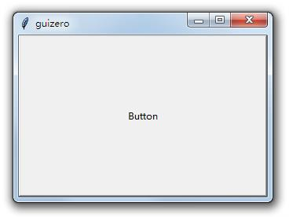

当多个小部件使用填充时，窗口管理器（操作系统）将相应地在需要填充它的所有小部件之间分配空间。

::

    from guizero import App, ListBox, PushButton
    app = App()
    list_box = ListBox(app, items=["a list", "of items", "yay"], height="fill", align="left")
    button = PushButton(app, width="fill", height="fill", align="right")
    app.display()

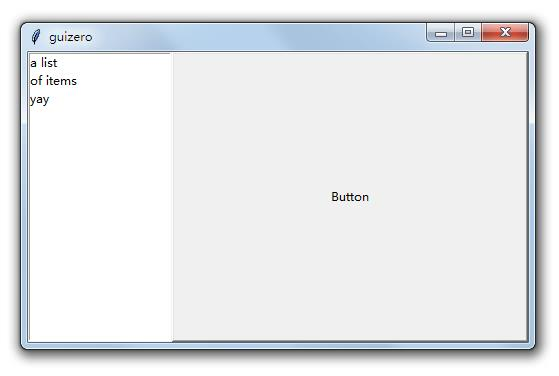

.. note ::

    使用填充并不总是具有您期望的效果，因为操作系统需要分配屏幕空间。

网格布局
===============================

网格布局允许您将小部件定位到虚拟网格中。

创建窗口小部件时，您需要传递一个名为 ``grid`` 的额外参数，该参数是一个包含 ``[x，y]`` 坐标的列表，用于显示窗口小部件的位置，如下所示：

::

    app = App(layout="grid")
    text = Text(app, text="Hello world", grid=[0,1])

无需指定所需网格的宽度或高度 - 它将根据您为每个窗口小部件提供的坐标进行扩展。但是，不包含对象的网格单元格将没有高度或宽度。

在创建希望窗口小部件排列的 GUI 时，这非常有用。例如：创建数字键盘。

::

    from guizero import App, PushButton

    app = App(layout="grid")

    button1 = PushButton(app, text="1", grid=[0,0])
    button2 = PushButton(app, text="2", grid=[1,0])
    button3  = PushButton(app, text="3", grid=[2,0])
    button4  = PushButton(app, text="4", grid=[0,1])
    button5  = PushButton(app, text="5", grid=[1,1])
    button6  = PushButton(app, text="6", grid=[2,1])
    button7  = PushButton(app, text="7", grid=[0,2])
    button8  = PushButton(app, text="8", grid=[1,2])
    button9  = PushButton(app, text="9", grid=[2,2])
    button0  = PushButton(app, text="0", grid=[1,3])

    app.display()

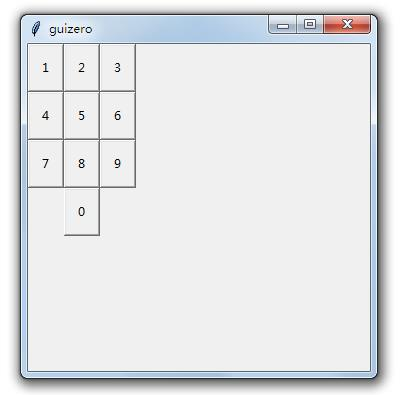

您还可以在网格中对齐小部件，例如在创建表单时：

::

    from guizero import App, Text, TextBox

    app = App(layout="grid")

    name_label = Text(app, text="Name", grid=[0,0], align="left")
    name = TextBox(app, grid=[1,0])
    surname_label = Text(app, text="Surname", grid=[0,1], align="left")
    surname = TextBox(app, grid=[1,1])
    dob_label = Text(app, text="Date of Birth", grid=[0,2], align="left")
    dob = TextBox(app, grid=[1,2])

    app.display()

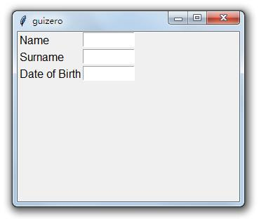

跨越列或行
-------------------------------

通过在 grid 参数中指定 span，可以使小部件跨越多个列或行。这些是可选的，但是如果指定，则必须使用格式 ``[x,y,xspan,yspan]`` 来包含它们。

下面的示例显示位于 0,1 的文本小部件，跨越两列（x）和一行（y）：

::

    text = Text(app, text="Hello world", grid=[0,1,2,1])

这可以用于包括彼此并排布置的不同尺寸的小部件。

::

    from guizero import App, Picture

    app = App(layout="grid")

    picture1 = Picture(app, image="std1.gif", grid=[0,0])
    picture2 = Picture(app, image="std2.gif", grid=[1,0])
    picture3 = Picture(app, image="tall1.gif", grid=[2,0,1,2])
    picture4 = Picture(app, image="wide1.gif", grid=[0,1,2,1])

    app.display()

.. image:: ../images/guizero.13.png

盒子布局
===============================

通过使用 Box 小部件，您可以将 GUI 划分为不同的部分，从而允许您以任何方式布置用户界面。

::

    from guizero import App, Box, Text, TextBox
    app = App()

    title_box = Box(app, width="fill", align="top", border=True)
    Text(title_box, text="title")

    buttons_box = Box(app, width="fill", align="bottom", border=True)
    Text(buttons_box, text="buttons")

    options_box = Box(app, height="fill", align="right", border=True)
    Text(options_box, text="options")

    content_box = Box(app, align="top", width="fill", border=True)
    Text(content_box, grid=[0,0], text="content")

    form_box = Box(content_box, layout="grid", width="fill", align="left", border=True)
    Text(form_box, grid=[0,0], text="form")
    Text(form_box, grid=[0,1], text="label")
    TextBox(form_box, grid=[1,1], text="data", width="fill")

    app.display()

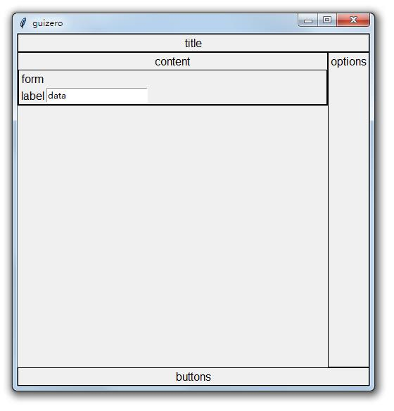

如果你想在 GUI 的左上角创建一个标题，你可以使用一个填充应用程序顶部的 Box，并将一个 Text 小部件放在左边。

::

    from guizero import App, Box, Text
    app = App()

    title_box = Box(app, width="fill", align="top")
    title = Text(title_box, text="title", align="left")

    app.display()

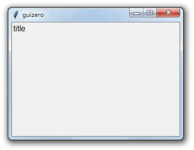

如果您的 Box 有边框，您可能会发现设计布局更容易，可以通过将 ``Box`` 上的 ``border`` 参数设置为 ``True`` 来完成。

::

    title_box = Box(app, width="fill", align="top", border=True)

可以使用类似的方法在 GUI 的右下角放置“确定”和“取消”按钮。请记住，小部件将按创建顺序堆叠在右侧，因此首先创建取消按钮。

::

    from guizero import App, Box, PushButton
    app = App()

    buttons_box = Box(app, width="fill", align="bottom")
    cancel = PushButton(buttons_box, text="Cancel", align="right")
    ok = PushButton(buttons_box, text="OK", align="right")

    app.display()

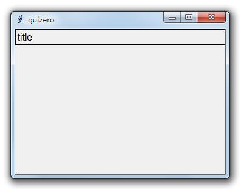

.. note ::

    Box 也可以包含在 Box 中，允许您分层框并定位窗口小部件。

在创建 GUI 时，最好首先在纸上设计出大体的位置，然后在动手。

弹窗
===============================

弹出窗口可用于通过提问或提供信息来提示用户操作。

使用弹窗之前，需要导入模块。例如：

::

    from guizero import warn, info

这些功能会在屏幕上弹出一个显示消息的框。可用的功能是：

* warn(title, text) - 带有警告图标的弹出框
* info(title, text) - 带有信息图标的弹出框
* error(title, text) - 带有错误图标的弹出框
* yesno(title, text) - 带有“是(Y)”和“否(N)”选项的弹出框。按“是(Y)”返回 ``True`` ，按“否(N)”返回 ``False`` 。

所有弹出框都使用本机显示，因此它们看起来会有所不同，具体取决于您的操作系统。

警告框
-------------------------------

这将弹出一个警告框，标题为 "Uh oh!" 和消息  "You are almost out of biscuits!" 。

::

    from guizero import App, warn
    app = App(title="Biscuit monitor")
    warn("Uh oh!", "You are almost out of biscuits!")
    app.display()

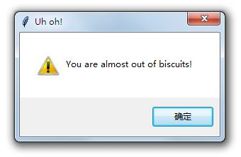

``info`` 和 ``error`` 与警告框的工作方式完全相同，但会显示不同的图标。

带选项的弹出框
-------------------------------

调用此 yesno 函数时，它返回一个布尔值。可以将此值存储在变量中并对其进行测试：

::

    from guizero import App, yesno, info, error
    app = App(title="Snowman")
    build_a_snowman = yesno("A question...", "Do you want to build a snowman?")
    if build_a_snowman == True:
        info("Snowman", "It doesn't have to be a snowman")
    else:
        error("Snowman", "Okay bye...")
    app.display()

首先显示是/否选项框：

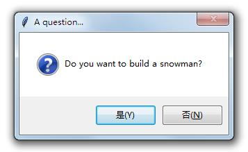

如果按下是，将显示一个信息框：

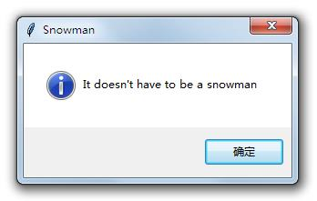

如果按下否，将显示错误框：

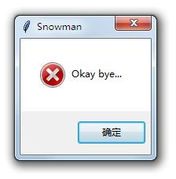

示例：使用警报作为回调
-------------------------------

您还可以在回调中使用这些函数（当您必须为另一个要调用的小部件提供函数时）。下面是一个 PushButton 示例，按下时会弹出一个信息框。

::

    from guizero import App, PushButton, info
    app = App()
    button = PushButton(app, command=info, args=["Info", "You pressed the button"])
    app.display()

提供给 PushButton 的参数是：

* 应该创建按钮的位置（在 app 内）
* 按下时要调用的函数的名称（info）
* 要调用的函数的参数列表（info 函数的 title 和 message 参数的值）

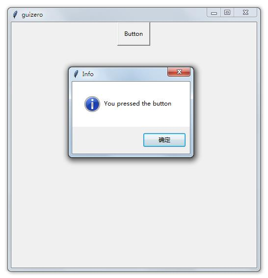

示例：你真的想要关闭吗？
-------------------------------

您可以使用 yesno 框来检查某人是否真的要退出应用。如果他们点击是，则关闭应用程序，否则，没有任何反应，他们可以继续他们正在做的事情。

::

    from guizero import App, Text, yesno

    # Ask the user if they really want to close the window
    def do_this_on_close():
        if yesno("Close", "Do you want to quit?"):
            app.destroy()

    app = App()

    title = Text(app, text="blank app")

    # When the user tries to close the window, run the function do_this_on_close()
    app.on_close(do_this_on_close)

    app.display()

尺寸
===============================

您可以在guizero中设置小部件的宽度和高度。

窗口小部件会按像素或字符大小调整，具体取决于窗口小部件及其包含的内容。某些小部件也可以将高度或宽度设置为 ``fill`` ，它将占用所有可用空间。

::

    from guizero import App, PushButton, Slider, ListBox

    app = App()

    # a PushButton's size is noted in characters
    button = PushButton(app, width=30, height=5)

    # a Slider's size is noted in pixels
    slider = Slider(app, width=300, height=30)

    # some widgets, such as ListBox can also be told to fill all the available space
    listbox = ListBox(app, width="fill", height="fill")

    app.display()

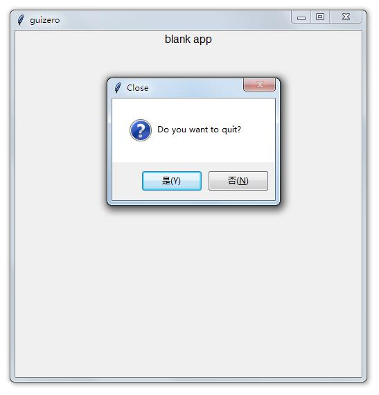

=============   ==========   ========   ========
小部件            字符/像素    fill       描述
=============   ==========   ========   ========
Box              像素         支持        如果 Box 的大小为像素，则必须指定宽度和高度。
ButtonGroup      字符         支持        单选框的高度必须除以其中的按钮数
CheckBox         字符         支持        复选框
Combo            字符         支持        下拉框
ListBox          字符         支持        列表框
Picture          像素         否          图片/图像
PushButton       字符         支持        按钮
PushButton       像素         否          带有图像的按钮大小以像素为单位
Slider           像素         支持        滑动框
Text             字符         支持        显示不可编辑的文本框
TextBox          字符         支持        显示用户可以键入的文本框
Waffle           像素         否          显示自定义尺寸和填充的 n*n 正方形网格
=============   ==========   ========   ========

颜色
===============================

您可以使用以下方法在 guizero 中设置颜色：

* 颜色的名称： ``white``
* RGB 十六进制值： ``#ffffff``
* RGB 值列表： ``(255,255,255)``

颜色可以用作起始参数，例如：

::

    app = App(bg = "red")
    app = App(bg = "#ff0000")
    app = App(bg = (255, 0, 0))

或作为属性，例如：

::

    text = Text(app, text = "hi")
    text.text_color = "green"
    text.text_color = "#00ff00"
    text.text_color = (0, 255, 0)

如果使用 rgb 值列表设置颜色（ ``(255,255,255)`` ），它将作为 #rgb 十六进制值返回（ ``#ffffff`` ）。

颜色名称
-------------------------------

颜色名称可以作为字符串给出，例如：

* white
* black
* red
* green
* blue
* yellow

.. _小部件:

小部件
*******************************
