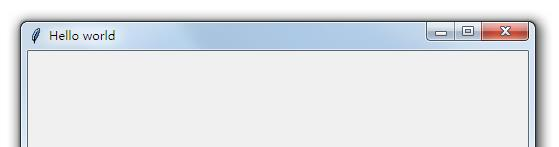
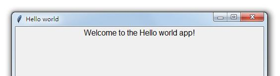
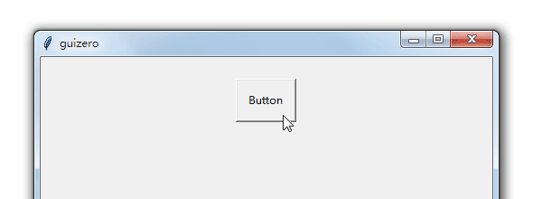
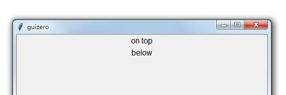

guizero 文档
################################

guizero 是标准 Tkinter 库的包装器，目标是让初学者更快速、轻松地创建 GUI 界面。使用 guizero 基本不需要 Tkinter 的知识，只需要基本的 Python 知识结构。如何安装 guizero 请参见 `PYPI`_。

.. _PYPI: https://pypi.org/project/guizero/

.. warning ::

    guizero 只适用于 Python3 环境，不支持 Python2.7。在使用 guizero 之前必须安装 Tkinter。

快速开始
*******************************

入门
===============================

从 guizero 库中选择您需要的小部件并导入它们：

.. highlight:: none

::

    from guizero import App, PushButton, Slider

Hello World
-------------------------------

所有 guizero 程序都以一个 ``App()`` 的主窗口开始，以 ``app.display()`` 结尾。

创建一个标题为“Hello world”的应用程序窗口：

::

    from guizero import App
    app = App(title="Hello world")
    app.display()

保存并运行上边的代码 - 您已经创建了第一个guizero应用程序！如下所示：

添加小部件
-------------------------------

窗口小部件是显示在 GUI 上的内容，例如文本框、按钮、滑块、图片等。

所有的小部件都在主窗口 ``App()`` 和 ``app.display()`` 之间创建。

::

    from guizero import App, Text
    app = App(title="Hello world")
    message = Text(app, text="Welcome to the Hello world app!")
    app.display()

让我们详细地看一下 Text 小部件的代码：

* message = Text 对象有一个名称，就像任何变量一样
* Text() 在屏幕上创建一段文本的对象
* app 文本对象的主窗口，即它将存在的位置。
* text="" 要显示的文本内容

要了解更多详细信息请查看 小部件_

命令
===============================

guizero 中的小部件可以在创建时给出命令。通过使用命令，可以在用户操作时执行特定命令。

以下程序，在按下按钮并松开时显示 hello world 文本内容：

::

    from guizero import App, Text, PushButton

    def say_hello():
        text.value = "hello world"

    app = App()
    text = Text(app)
    button = PushButton(app, command=say_hello)
    app.display()

页面布局
===============================

GUI 的布局就是如何在窗口中安排小部件。

可以有两种布局方式将小部件安排到“容器”（例如 ``App`` 和 ``Box`` ）中：

* auto 自动布局（默认值）
* grid 网格布局

使用容器的布局参数设置布局，例如：

::

    app = App(layout="auto")
    app = App(layout="grid")

如果未指定布局参数，则使用默认值。

自动布局
-------------------------------

auto 是创建容器时使用的默认值。所有小部件将按创建顺序上下排列并以中心对齐，例如以下代码将创建两个 Text 小部件，一个在另一个之上。

::

    from guizero import App, Text
    app = App()
    text_1 = Text(app, text="on top")
    text_2 = Text(app, text="below")
    app.display()

对齐布局
-------------------------------

窗口小部件可以在创建时使用align属性与顶部，底部，左侧或右侧对齐。

.. _小部件:

小部件
*******************************
